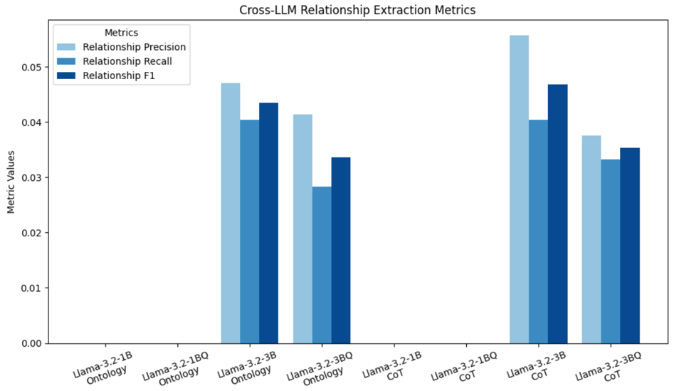
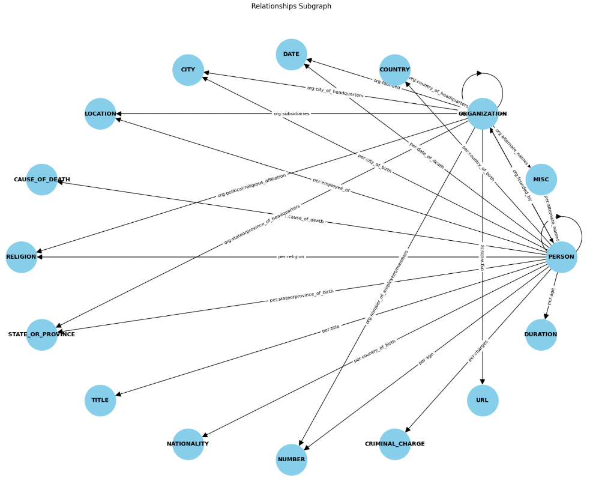

# Joseph Krozak (JKK2139), Date: 12/22/2024
# COMS E6998-013 High Performance Machine Learning – Final Project
# Real-Time Multi-Modal Fusion for Situational Awareness in Emergency 
# Response Using Deep Learning, Large Language Models, 
# and Performance Optimization

## Description
This project evaluates the performance of base and quantized Llama-3.2 1B & 3B models for entity and relationship extraction tasks. It leverages a single Jupyter notebook for ontology loading, prompt generation, and result evaluation.

## Contents
- `20241222-E6998-013-Final-Project.ipynb`: The main Jupyter notebook used to perform all operations, including ontology loading, prompt generation, model inference, and result evaluation.
- `./data/tacred/`: Contains the TACRED dataset JSON files (train.json, dev.json, test.json)
- `./output/`:  Directory containing PKL files storing run results for visualizations and analysis. These files are automatically generated or loaded during notebook execution. 
- `README.md`: This file, detailing the project structure, setup, and instructions for evaluation.
- `./charts/`: Contains pre-generated images of key figures (e.g., confusion matrices, performance metrics) for inclusion in results if execution is skipped.

## Setup and Installation
1. Clone the repository:
   ```bash
   git clone https://github.com/robotron-2084/HPML.git
2. cd HPML
3. Install the following packages: sentence-transformers, pandas, numpy, matplotlib, networkx, 

4. Configure API Access
	
	a. Llama 3.2 Instance
	
	Ensure that you have access to a Llama 3.2 instance running in a llama-stack environment. This is required to execute the Llama-related tests. You will need the endpoint and port of the running instance, which should be correctly configured in your scripts or notebook.
	
5. Run the Jupyter Notebook

To evaluate the project, open the Jupyter notebook provided in the repository. Start a Jupyter Notebook server:

	jupyter notebook

Then open the project notebook (20241220-E6998-013-Final-Project.ipynb) and step through the cells sequentially.

6. Notes on Execution

	Tests for Llama 3.2 require a running instance of the model. Ensure the connection details (e.g., endpoint URL, port) are properly configured in the code before running these cells.

	Review and modify any environment-specific paths or configurations as needed.
	
7. Result Snapshots

	The following are some of the visualizations included in the Jupter notebook
	
	
	
	
	
	
	
	
	
	
	
	
	
	
	
	